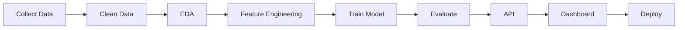

<!-- ===================================================== -->
<!--                 ENTITY ARSENAL PROFILE                 -->
<!-- ===================================================== -->

<div align="center">


# 👋 Hello World!


<p>


</p>

<p>

<a href="mailto:entityarsenal@gmail.com">

</a>

<a href="https://github.com/NawazKotwalkar">

</a>

</p>

</div>

---

# 🚀 About Me

```python
class NawazKotwalkar:

    def __init__(self):

        self.role = "Aspiring Data Scientist"

        self.location = "Mumbai, India"

        self.focus = [
            "Machine Learning",
            "Data Science",
            "Decision Intelligence",
            "Computer Vision",
            "Data Engineering",
            "AI Applications"
        ]

        self.languages = [
            "Python",
            "SQL",
            "JavaScript",
            "R"
        ]

        self.current_projects = [
            "CanER",
            "InsightForgeAI",
            "DataSentry",
            "AI Insurance Claim Automation"
        ]

        self.motto = "Turning Data into Decisions."

    def say_hi(self):
        print("Thanks for visiting my profile 🚀")
```

---

# 🧠 Current Focus

- 🔥 Building production-ready AI applications
- 📊 Decision Intelligence Platforms
- 🤖 Machine Learning & Deep Learning
- 📈 Data Analytics Dashboards
- 🏥 Healthcare AI
- 💰 Financial AI
- 🧩 End-to-End ML Pipelines
- 🚀 Open Source Development

---

# ⚡ Tech Arsenal

## Languages

<p>


</p>

---

## Frameworks

<p>


</p>

---

## Libraries

<p>


</p>

---

## Tools

<p>


</p>

---

# 📊 GitHub Analytics

<div align="center">


</div>

---

<div align="center">


</div>

---

# 📈 Contribution Graph

<div align="center">


</div>

---

# 🐍 Contribution Snake

<div align="center">


</div>

---

# 💡 Philosophy

> **"Data tells stories. AI makes decisions. Software delivers impact."**

## 🚀 Featured Projects

<table>
<tr>

<td width="50%">

### 🏥 CanER

### Canadian ER Wait Time Prediction System

> AI-powered healthcare intelligence platform that predicts emergency room wait times across Canada using Machine Learning.

**Highlights**

* 🤖 XGBoost Regression Model
* ⚡ FastAPI Backend
* 📊 Interactive Dashboard
* 🗺️ Hospital Map Visualization
* 🐳 Docker Deployment
* ☁️ Render Hosting

**Tech Stack**

`Python` `FastAPI` `XGBoost` `Scikit-Learn` `JavaScript` `HTML` `CSS`

<p align="center">

<a href="https://github.com/NawazKotwalkar/CanER">

</a>

</p>

</td>

<td width="50%">

### 📊 DataSentry

### Data Quality Intelligence Platform

> Enterprise-grade platform that transforms raw datasets into business-ready insights with automated quality scoring.

**Highlights**

* 📈 Data Quality Score
* 💰 Business Cost Analysis
* 📑 Data Dictionary
* 📊 Executive Dashboard
* ⚠️ Issue Detection
* 📋 Automated Reports

**Tech Stack**

`Python` `Pandas` `Streamlit` `Great Expectations` `Plotly`

<p align="center">

<a href="https://github.com/NawazKotwalkar/DataSentry">

</a>

</p>

</td>

</tr>

<tr>

<td width="50%">

### 📈 InsightForgeAI

### Decision Intelligence Platform

> AI-powered business analytics platform for transforming raw business data into actionable executive insights.

**Highlights**

* 📊 KPI Dashboard
* 📉 Forecasting
* 🧠 AI Insights
* 📄 Executive Reports
* 📂 CSV Analysis
* 📈 Business Intelligence

**Tech Stack**

`Python` `Streamlit` `Plotly` `Pandas` `NumPy`

<p align="center">

<a href="https://github.com/NawazKotwalkar/InsightForgeAI">

</a>

</p>

</td>

<td width="50%">

### 💰 Expenxo

### Spending Behaviour Prediction

> Personal finance intelligence platform with budgeting, analytics and machine learning based expense prediction.

**Highlights**

* 💹 Budget Tracking
* 📊 Spending Analytics
* 🤖 Random Forest Prediction
* 📈 Expense Forecasting
* 📋 Financial Reports
* 🔐 User Authentication

**Tech Stack**

`Python` `Streamlit` `Random Forest` `MySQL` `Pandas`

<p align="center">

<a href="https://github.com/NawazKotwalkar/Spending-Behavior-Prediction">

</a>

</p>

</td>

</tr>

</table>

---

# 🏆 Featured Technologies

<div align="center">

| AI & ML          | Data Engineering    | Backend   | Visualization |
| ---------------- | ------------------- | --------- | ------------- |
| Machine Learning | Data Cleaning       | FastAPI   | Plotly        |
| Scikit-Learn     | ETL                 | Streamlit | Matplotlib    |
| XGBoost          | Feature Engineering | Flask     | Dash          |
| Forecasting      | Data Validation     | REST APIs | Chart.js      |

</div>

---

# 🎯 What I Build

```text
                DATA
                  │
                  ▼
        Data Cleaning & Validation
                  │
                  ▼
      Exploratory Data Analysis
                  │
                  ▼
       Feature Engineering
                  │
                  ▼
        Machine Learning Model
                  │
                  ▼
          API Development
                  │
                  ▼
      Interactive Dashboard
                  │
                  ▼
       Business Intelligence
                  │
                  ▼
      Production Deployment
```

---

# 🌟 Project Domains

<div align="center">

| Domain                   | Projects                             |
| ------------------------ | ------------------------------------ |
| 🏥 Healthcare AI         | CanER, AI Insurance Claim Automation |
| 💰 Financial AI          | Expenxo, Fraud Detection             |
| 📊 Decision Intelligence | InsightForgeAI                       |
| 📈 Data Quality          | DataSentry                           |
| 🤖 Machine Learning      | All Major Projects                   |
| 📉 Business Analytics    | InsightForgeAI, DataSentry           |

</div>

---

# 📌 Currently Working On

* 🚀 Enterprise AI Applications
* 🤖 LLM-powered Analytics
* 📊 Decision Intelligence Platforms
* 🏥 Healthcare Machine Learning
* 📈 Predictive Analytics
* ⚙️ Data Engineering Pipelines
* 🧠 MLOps Fundamentals
* 🌐 Open Source Contributions

---

# 🛠 Development Workflow



---

# 🏅 GitHub Achievements

<div align="center">


</div>

---

# 🎓 Learning Roadmap

| Status | Technology         |
| ------ | ------------------ |
| ✅      | Python             |
| ✅      | SQL                |
| ✅      | Machine Learning   |
| ✅      | Data Visualization |
| ✅      | FastAPI            |
| ✅      | Streamlit          |
| 🔄     | Deep Learning      |
| 🔄     | Computer Vision    |
| 🔄     | Docker             |
| 🔄     | MLOps              |
| ⏳      | Kubernetes         |
| ⏳      | Apache Spark       |
| ⏳      | Apache Airflow     |
| ⏳      | AWS                |
| ⏳      | LangChain          |
| ⏳      | LangGraph          |
| ⏳      | RAG Systems        |

---

# 💬 Favorite Quote

> **"The goal isn't just to build models—it's to build intelligent products that create measurable business impact."**

---

