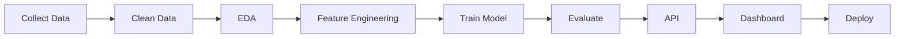

<!-- ===================================================== -->
<!--                 NAWAZ KOTWALKAR PROFILE                -->
<!-- ===================================================== -->

<div align="center">


<p>


</p>


<p>
<a href="mailto:entityarsenal@gmail.com"></a>
<a href="https://www.linkedin.com/in/nawazkotwalkar"></a>
<a href="https://github.com/NawazKotwalkar"></a>
</p>

</div>

---

# About Me

```python
class NawazKotwalkar:

    def __init__(self):
        self.role = "Data Scientist"
        self.location = "Mumbai, India"

        self.focus = [
            "Machine Learning",
            "Data Science",
            "Decision Intelligence",
            "Data Engineering",
            "AI Applications"
        ]

        self.languages = ["Python", "SQL", "JavaScript"]

        self.current_projects = [
            "CanER",
            "InsightForgeAI",
            "DataSentry",
            "AI Insurance Claim Automation"
        ]

        self.motto = "Turning Data into Decisions."

    def say_hi(self):
        print("Thanks for visiting my profile.")
```

---

# Current Focus

- Building production-ready AI applications
- Decision intelligence platforms
- Machine learning & predictive modeling
- Healthcare AI
- Financial AI / fraud detection
- End-to-end ML pipelines
- Open source development

---

# Tech Arsenal

### Languages
<p></p>

### Frameworks
<p></p>

### Libraries
<p></p>

### Tools
<p></p>

---

# GitHub Analytics

<div align="center">


</div>

<div align="center">


</div>

---

# Contribution Graph

<div align="center">


</div>

---

# Contribution Snake

<div align="center">


</div>

> Wired to `snake.yml` below — once added, this regenerates daily on its own.

---

# Philosophy

> **"Data tells stories. AI makes decisions. Software delivers impact."**

## Featured Projects

<table>
<tr>

<td width="50%">

### CanER
### Canadian ER Wait Time Prediction System

> Predicts emergency room wait times across Canada using machine learning, served through a live API and hospital-map dashboard.

**Highlights**
- XGBoost regression model
- FastAPI backend
- Interactive hospital map
- Docker + Render deployment

**Stack:** `Python` `FastAPI` `XGBoost` `Scikit-Learn` `JavaScript`

<p align="center"><a href="https://github.com/NawazKotwalkar/CanER"></a></p>

</td>

<td width="50%">

### DataSentry
### Data Quality Intelligence Platform

> Scores dataset health, detects data issues, and quantifies the business cost of bad data.

**Highlights**
- Data quality scoring
- Business cost analysis
- Automated issue detection
- Executive dashboard

**Stack:** `Python` `Pandas` `Streamlit` `Plotly`

<p align="center"><a href="https://github.com/NawazKotwalkar/DataSentry"></a></p>

</td>

</tr>
<tr>

<td width="50%">

### InsightForgeAI
### Decision Intelligence Platform

> Transforms raw business data into forecasts and executive-ready insight reports.

**Highlights**
- KPI dashboard
- Forecasting
- Executive reports
- CSV analysis

**Stack:** `Python` `Streamlit` `Plotly` `Pandas` `NumPy`

<p align="center"><a href="https://github.com/NawazKotwalkar/InsightForgeAI"></a></p>

</td>

<td width="50%">

### Spending Behaviour Prediction
### Personal Finance Intelligence

> Budgeting and spending analytics app with Random Forest-based expense forecasting.

**Highlights**
- Budget tracking
- Spending analytics
- Random Forest prediction
- Financial reports

**Stack:** `Python` `Streamlit` `Random Forest` `MySQL`

<p align="center"><a href="https://github.com/NawazKotwalkar/Spending-Behavior-Prediction"></a></p>

</td>

</tr>
<tr>

<td width="50%">

### AI Insurance Claim Automation
### Healthcare Claims Intelligence

> EDA and fraud-pattern detection on insurance claims — auto-decisioning logic and fraud-prioritization flagging.

**Highlights**
- Fraud pattern detection
- Auto-decisioning logic
- Claims EDA
- NHS-domain dataset

**Stack:** `Python` `Pandas` `Plotly`

<p align="center"><a href="https://github.com/NawazKotwalkar/AI-INSURANCE-CLAIM-AUTOMATION"></a></p>

</td>

<td width="50%">

### Fraud Detection
### Logistic Regression Classifier

> Financial fraud detection tuned for recall over accuracy, with business-aligned evaluation metrics.

**Highlights**
- Logistic regression model
- Recall-optimized
- Scalable pipeline
- Business-aligned metrics

**Stack:** `Python` `Scikit-Learn`

<p align="center"><a href="https://github.com/NawazKotwalkar/Fraud_Detection_Logistic_Regression"></a></p>

</td>

</tr>
</table>

---

# Featured Technologies

<div align="center">

| AI & ML | Data Engineering | Backend | Visualization |
|---|---|---|---|
| Machine Learning | Data Cleaning | FastAPI | Plotly |
| Scikit-Learn | ETL | Streamlit | Matplotlib |
| XGBoost | Feature Engineering | Flask | Chart.js |
| Logistic Regression | Data Validation | REST APIs | Dash |

</div>

---

# What I Build

```text
                DATA
                  |
                  v
        Data Cleaning & Validation
                  |
                  v
      Exploratory Data Analysis
                  |
                  v
       Feature Engineering
                  |
                  v
        Machine Learning Model
                  |
                  v
          API Development
                  |
                  v
      Interactive Dashboard
                  |
                  v
       Business Intelligence
                  |
                  v
      Production Deployment
```

---

# Project Domains

<div align="center">

| Domain | Projects |
|---|---|
| Healthcare AI | CanER, AI Insurance Claim Automation |
| Financial AI | Spending Behaviour Prediction, Fraud Detection |
| Decision Intelligence | InsightForgeAI |
| Data Quality | DataSentry |

</div>

---

# Development Workflow



---

# GitHub Achievements

<div align="center">


</div>

---

# Learning Roadmap

| Status | Technology |
|---|---|
| Done | Python |
| Done | SQL |
| Done | Machine Learning |
| Done | Data Visualization |
| Done | FastAPI |
| Done | Streamlit |
| In Progress | Deep Learning |
| In Progress | Docker |
| In Progress | MLOps |
| Planned | AWS |
| Planned | LangChain |
| Planned | RAG Systems |

---

# Favorite Quote

> **"The goal isn't just to build models — it's to build intelligent products that create measurable business impact."**

---

# Recent GitHub Activity

<!--START_SECTION:activity-->
<!-- This section auto-populates via the readme-activity-feed GitHub Action once set up on your repo. -->
<!--END_SECTION:activity-->

> Wired to `activity.yml` below — once added, this section fills itself in automatically every 6 hours.

---

# Open Source Philosophy

> The best way to learn is by building real-world projects, sharing knowledge openly, and contributing back to the developer community. Every project here solves a practical problem with data and AI.

---

# Connect With Me

<div align="center">

<a href="mailto:entityarsenal@gmail.com"></a>
<a href="https://github.com/NawazKotwalkar"></a>
<a href="https://www.linkedin.com/in/nawazkotwalkar"></a>

</div>

---

# Profile Views

<div align="center">


</div>

---

<div align="center">

## Thanks for visiting.


</div>
