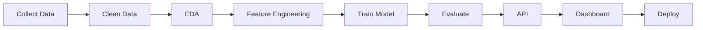

<!-- ===================================================== -->
<!--                 ENTITY ARSENAL PROFILE                 -->
<!-- ===================================================== -->

<div align="center">


# 👋 Hello World!


<p>


</p>

<p>

<a href="mailto:entityarsenal@gmail.com">

</a>

<a href="https://github.com/NawazKotwalkar">

</a>

</p>

</div>

---

# 🚀 About Me

```python
class NawazKotwalkar:

    def __init__(self):

        self.role = "Aspiring Data Scientist"

        self.location = "Mumbai, India"

        self.focus = [
            "Machine Learning",
            "Data Science",
            "Decision Intelligence",
            "Computer Vision",
            "Data Engineering",
            "AI Applications"
        ]

        self.languages = [
            "Python",
            "SQL",
            "JavaScript",
            "R"
        ]

        self.current_projects = [
            "CanER",
            "InsightForgeAI",
            "DataSentry",
            "AI Insurance Claim Automation"
        ]

        self.motto = "Turning Data into Decisions."

    def say_hi(self):
        print("Thanks for visiting my profile 🚀")
```

---

# 🧠 Current Focus

- 🔥 Building production-ready AI applications
- 📊 Decision Intelligence Platforms
- 🤖 Machine Learning & Deep Learning
- 📈 Data Analytics Dashboards
- 🏥 Healthcare AI
- 💰 Financial AI
- 🧩 End-to-End ML Pipelines
- 🚀 Open Source Development

---

# ⚡ Tech Arsenal

## Languages

<p>


</p>

---

## Frameworks

<p>


</p>

---

## Libraries

<p>


</p>

---

## Tools

<p>


</p>

---

# 📊 GitHub Analytics

<div align="center">


</div>

---

<div align="center">


</div>

---

# 📈 Contribution Graph

<div align="center">


</div>

---

# 🐍 Contribution Snake

<div align="center">


</div>

---

# 💡 Philosophy

> **"Data tells stories. AI makes decisions. Software delivers impact."**

## 🚀 Featured Projects

<table>
<tr>

<td width="50%">

### 🏥 CanER

### Canadian ER Wait Time Prediction System

> AI-powered healthcare intelligence platform that predicts emergency room wait times across Canada using Machine Learning.

**Highlights**

* 🤖 XGBoost Regression Model
* ⚡ FastAPI Backend
* 📊 Interactive Dashboard
* 🗺️ Hospital Map Visualization
* 🐳 Docker Deployment
* ☁️ Render Hosting

**Tech Stack**

`Python` `FastAPI` `XGBoost` `Scikit-Learn` `JavaScript` `HTML` `CSS`

<p align="center">

<a href="https://github.com/NawazKotwalkar/CanER">

</a>

</p>

</td>

<td width="50%">

### 📊 DataSentry

### Data Quality Intelligence Platform

> Enterprise-grade platform that transforms raw datasets into business-ready insights with automated quality scoring.

**Highlights**

* 📈 Data Quality Score
* 💰 Business Cost Analysis
* 📑 Data Dictionary
* 📊 Executive Dashboard
* ⚠️ Issue Detection
* 📋 Automated Reports

**Tech Stack**

`Python` `Pandas` `Streamlit` `Great Expectations` `Plotly`

<p align="center">

<a href="https://github.com/NawazKotwalkar/DataSentry">

</a>

</p>

</td>

</tr>

<tr>

<td width="50%">

### 📈 InsightForgeAI

### Decision Intelligence Platform

> AI-powered business analytics platform for transforming raw business data into actionable executive insights.

**Highlights**

* 📊 KPI Dashboard
* 📉 Forecasting
* 🧠 AI Insights
* 📄 Executive Reports
* 📂 CSV Analysis
* 📈 Business Intelligence

**Tech Stack**

`Python` `Streamlit` `Plotly` `Pandas` `NumPy`

<p align="center">

<a href="https://github.com/NawazKotwalkar/InsightForgeAI">

</a>

</p>

</td>

<td width="50%">

### 💰 Expenxo

### Spending Behaviour Prediction

> Personal finance intelligence platform with budgeting, analytics and machine learning based expense prediction.

**Highlights**

* 💹 Budget Tracking
* 📊 Spending Analytics
* 🤖 Random Forest Prediction
* 📈 Expense Forecasting
* 📋 Financial Reports
* 🔐 User Authentication

**Tech Stack**

`Python` `Streamlit` `Random Forest` `MySQL` `Pandas`

<p align="center">

<a href="https://github.com/NawazKotwalkar/Spending-Behavior-Prediction">

</a>

</p>

</td>

</tr>

</table>

---

# 🏆 Featured Technologies

<div align="center">

| AI & ML          | Data Engineering    | Backend   | Visualization |
| ---------------- | ------------------- | --------- | ------------- |
| Machine Learning | Data Cleaning       | FastAPI   | Plotly        |
| Scikit-Learn     | ETL                 | Streamlit | Matplotlib    |
| XGBoost          | Feature Engineering | Flask     | Dash          |
| Forecasting      | Data Validation     | REST APIs | Chart.js      |

</div>

---

# 🎯 What I Build

```text
                DATA
                  │
                  ▼
        Data Cleaning & Validation
                  │
                  ▼
      Exploratory Data Analysis
                  │
                  ▼
       Feature Engineering
                  │
                  ▼
        Machine Learning Model
                  │
                  ▼
          API Development
                  │
                  ▼
      Interactive Dashboard
                  │
                  ▼
       Business Intelligence
                  │
                  ▼
      Production Deployment
```

---

# 🌟 Project Domains

<div align="center">

| Domain                   | Projects                             |
| ------------------------ | ------------------------------------ |
| 🏥 Healthcare AI         | CanER, AI Insurance Claim Automation |
| 💰 Financial AI          | Expenxo, Fraud Detection             |
| 📊 Decision Intelligence | InsightForgeAI                       |
| 📈 Data Quality          | DataSentry                           |
| 🤖 Machine Learning      | All Major Projects                   |
| 📉 Business Analytics    | InsightForgeAI, DataSentry           |

</div>

---

# 📌 Currently Working On

* 🚀 Enterprise AI Applications
* 🤖 LLM-powered Analytics
* 📊 Decision Intelligence Platforms
* 🏥 Healthcare Machine Learning
* 📈 Predictive Analytics
* ⚙️ Data Engineering Pipelines
* 🧠 MLOps Fundamentals
* 🌐 Open Source Contributions

---

# 🛠 Development Workflow



---

# 🏅 GitHub Achievements

<div align="center">


</div>

---

# 🎓 Learning Roadmap

| Status | Technology         |
| ------ | ------------------ |
| ✅      | Python             |
| ✅      | SQL                |
| ✅      | Machine Learning   |
| ✅      | Data Visualization |
| ✅      | FastAPI            |
| ✅      | Streamlit          |
| 🔄     | Deep Learning      |
| 🔄     | Computer Vision    |
| 🔄     | Docker             |
| 🔄     | MLOps              |
| ⏳      | Kubernetes         |
| ⏳      | Apache Spark       |
| ⏳      | Apache Airflow     |
| ⏳      | AWS                |
| ⏳      | LangChain          |
| ⏳      | LangGraph          |
| ⏳      | RAG Systems        |

---

# 💬 Favorite Quote

> **"The goal isn't just to build models—it's to build intelligent products that create measurable business impact."**

---

---

# 📊 Live Coding Statistics

<div align="center">

<!-- Replace YOUR_WAKATIME_USERNAME with your username -->


</div>

> **Note:** This section becomes active after connecting your WakaTime account.

---

# ⚡ Recent GitHub Activity

<!--START_SECTION:activity-->

* 🚀 Pushed new commits to **CanER**
* 📊 Improved **DataSentry**
* 🧠 Updated **InsightForgeAI**
* 💰 Enhanced **Expenxo**
* 🏥 Working on Healthcare AI

<!--END_SECTION:activity-->

---

# 📦 Latest Repositories

<!-- START_SECTION:repositories -->

| Repository                       | Description                                   |
| -------------------------------- | --------------------------------------------- |
| 🚀 CanER                         | AI-powered Canadian ER Wait Prediction System |
| 📊 DataSentry                    | Enterprise Data Quality Intelligence Platform |
| 📈 InsightForgeAI                | Decision Intelligence Platform                |
| 💰 Expenxo                       | Personal Finance Analytics & Prediction       |
| 🏥 AI Insurance Claim Automation | Healthcare KPI Dashboard                      |

<!-- END_SECTION:repositories -->

---

# 📈 Weekly Development Breakdown

```text
Python            ████████████████████ 78%
SQL               ████                 12%
Markdown          ██                    5%
JavaScript        █                     3%
Other             █                     2%
```

---

# 🎯 2026 Goals

* ✅ Build Production AI Applications
* ✅ Publish Open Source Projects
* 🔄 Master Deep Learning
* 🔄 Learn MLOps
* 🔄 Build RAG Applications
* 🔄 Contribute to Open Source
* 🔄 Learn Kubernetes
* 🔄 Deploy AI Systems on AWS

---

# 📚 Currently Learning

```python
learning = {
    "Machine Learning": "██████████ 100%",
    "Deep Learning": "██████░░░░ 60%",
    "Computer Vision": "███████░░░ 70%",
    "MLOps": "████░░░░░░ 40%",
    "Docker": "████████░░ 80%",
    "AWS": "███░░░░░░░ 30%",
    "LangChain": "██░░░░░░░░ 20%",
    "Apache Spark": "██░░░░░░░░ 20%"
}

for skill, progress in learning.items():
    print(f"{skill}: {progress}")
```

---

# 🌍 Open Source Philosophy

> I believe the best way to learn is by building real-world projects, sharing knowledge openly, and contributing back to the developer community. Every project in my portfolio is an opportunity to solve practical problems with data and AI.

---

# 🎵 Now Playing

<div align="center">

<!-- Replace with your Spotify username using GitHub Actions -->


</div>

---

# 🌐 Connect With Me

<div align="center">

<a href="mailto:entityarsenal@gmail.com">

</a>

<a href="https://github.com/NawazKotwalkar">

</a>

<!-- Replace with your actual profile links -->

<a href="https://linkedin.com/in/YOUR_LINKEDIN_USERNAME">

</a>

<a href="https://www.kaggle.com/YOUR_KAGGLE_USERNAME">

</a>

<a href="https://x.com/YOUR_X_USERNAME">

</a>

</div>

---

# 💖 Support My Work

If you enjoy my projects or find them useful:

⭐ Star my repositories

🍴 Fork and contribute

🐛 Open issues for improvements

💡 Share feedback and ideas

🤝 Let's collaborate on AI, Data Science, and Open Source projects

---

# 👀 Profile Views

<div align="center">


</div>

---

# ✨ Fun Fact

```python
while True:
    learn()
    build()
    improve()
    deploy()
    share()
```

> **"Stay curious. Build consistently. Let your work speak louder than your résumé."**

---

<div align="center">

## Thanks for visiting! 🚀

If you like what you see, consider following my journey and checking out my repositories.


</div>
